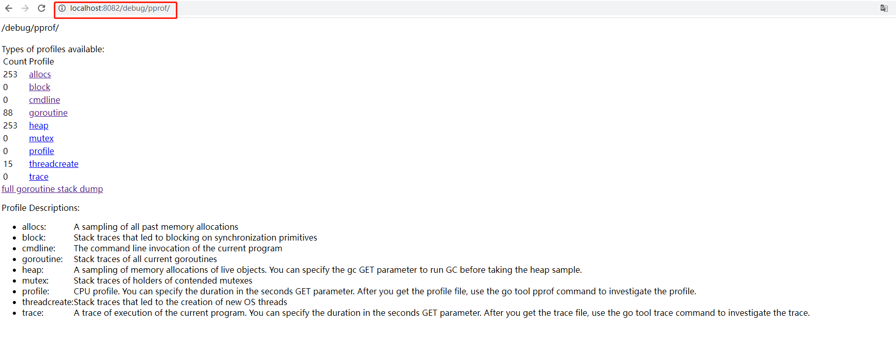

# 基于http协议的网络服务的性能分析

我们可以使用`net/http/pprof`官方标准库将采集概要文件的代码嵌入到程序中，用法如下：

```go
package main

import (
	"log"
	"net/http"
	_ "net/http/pprof"
)

func main() {
	go func() {
		log.Println(http.ListenAndServe("localhost:8082", nil))
	}()
	
	//do something ...
}
```
运行程序后，我们就可以通过在网络浏览器访问 http://localhost:8082/debug/pprof 来查看程序的概要信息。

## 界面说明


能够提供给我们分析的信息有：

| 概要信息 | 说明 |
| --- | --- |
| 分配空间 allocs | 记录所有过去分配的内存空间 <br> 通过访问链接：http://localhost:8082/debug/pprof 查看  |
| 阻塞 block | 收集因争用同步原语（指的是存在与Go语言运行时系统内部的一种底层的同步工具，或者一种同步机制）而被阻塞的代码的跟踪信息 <br> 可通过命令：`go tool pprof http://localhost:8082/debug/pprof/block` 查看 |
| 命令行 cmdline | 当前程序的命令行调用位置 |
| 协程 goroutine | 收集当前正在使用的所有 goroutine 的堆栈跟踪信息 |
| 堆 heap | 收集与“堆内存”的分配和释放有关的采样信息 <br> 可通过命令：`go tool pprof http://localhost:8082/debug/pprof/heap` 查看|
| 互斥锁 mutex | 收集作为同步原语（指的是存在与Go语言运行时系统内部的一种底层的同步工具，或者一种同步机制）持有者的代码的跟踪信息 <br> 可通过命令：`go tool pprof http://localhost:8082/debug/pprof/mutex` 查看 |
| CPU概要文件 profile | CPU概要文件，点击后会下载 <br> 可通过命令：`go tool pprof http://localhost:8082/debug/pprof/profile?seconds=30` 查看 |
| 线程创建 threadcreate | 收集出导致新产生出操作系统线程的代码调用链 |
| 轨迹 trace | 当前程序的执行轨迹 <br> 可通过：wget -O trace.out http://localhost:6060/debug/pprof/trace?seconds=5 && go tool trace trace.out | 

| 查询参数 | 意义 |
| --- | --- |
| debug=1 | 用于控制概要信息的格式和详细程度 |
| gc=1 | 用于控制是否在获取概要信息之前强制执行一次垃圾回收（此参数仅在路径`/debug/pprof/heap`下有效 ） |
| seconds=30 | 表示采样工作需要多少秒，默认为30秒（此参数仅在路径`/debug/pprof/profile`下有效） |
|

## 底层原理说明

在导入`net/http/pprof`包，会运行pprof包的init函数，注册相应的路由到http服务器
```gotemplate
func init() {
	http.HandleFunc("/debug/pprof/", Index)
	http.HandleFunc("/debug/pprof/cmdline", Cmdline)
	http.HandleFunc("/debug/pprof/profile", Profile)
	http.HandleFunc("/debug/pprof/symbol", Symbol)
	http.HandleFunc("/debug/pprof/trace", Trace)
}
```