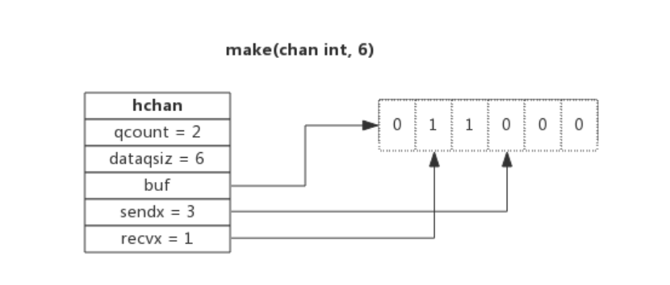
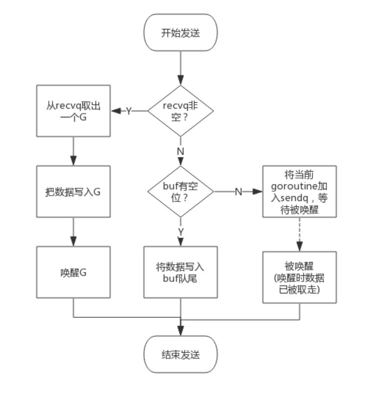
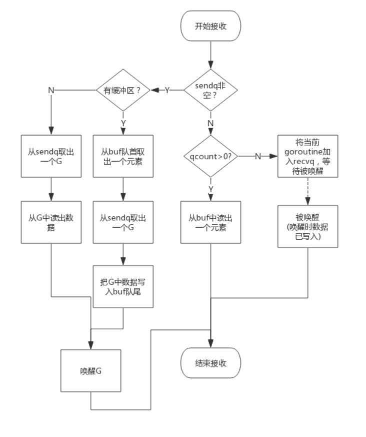

# chan 通道类型

channel是Golang在语言层面提供的goroutine间的通信方式，比Unix管道更易用也更轻便。channel主要用于进程内各goroutine间通信，如果需要跨进程通信，建议使用分布式系统的方法来解决。

`src/runtime/chan.go:hchan`定义了channel的数据结构：
```gotemplate
type hchan struct {
    qcount   uint           // 当前队列中剩余元素个数
    dataqsiz uint           // 环形队列长度，即可以存放的元素个数
    buf      unsafe.Pointer // 环形队列指针
    elemsize uint16         // 每个元素的大小
    closed   uint32            // 标识关闭状态
    elemtype *_type         // 元素类型
    sendx    uint           // 队列下标，指示元素写入时存放到队列中的位置
    recvx    uint           // 队列下标，指示元素从队列的该位置读出
    recvq    waitq          // 等待读消息的goroutine队列
    sendq    waitq          // 等待写消息的goroutine队列
    lock mutex              // 互斥锁，chan不允许并发读写
}
```
从数据结构可以看出channel由队列、类型信息、goroutine等待队列组成

---------------

下面分别说明其原理:

## 环形队列

chan内部实现了一个环形队列作为其缓冲区，队列的长度是创建chan时指定的。

下图展示了一个可缓存6个元素的channel示意图：

- dataqsiz指示了队列长度为6，即可缓存6个元素；
- buf指向队列的内存，队列中还剩余两个元素；
- qcount表示队列中还有两个元素；
- sendx指示后续写入的数据存储的位置，取值[0, 6)；
- recvx指示从该位置读取数据, 取值[0, 6)；

## 等待队列

从channel读数据，如果channel缓冲区为空或者没有缓冲区，当前goroutine会被阻塞。 向channel写数据，如果channel缓冲区已满或者没有缓冲区，当前goroutine会被阻塞。

被阻塞的goroutine将会挂在channel的等待队列中：

- 因读阻塞的goroutine会被向channel写入数据的goroutine唤醒；
- 因写阻塞的goroutine会被从channel读数据的goroutine唤醒；

下图展示了一个没有缓冲区的channel，有几个goroutine阻塞等待读数据：

注意，一般情况下recvq和sendq至少有一个为空。只有一个例外，那就是同一个goroutine使用select语句向channel一边写数据，一边读数据。

## 类型信息

一个channel只能传递一种类型的值，类型信息存储在hchan数据结构中。

- elemtype代表类型，用于数据传递过程中的赋值；
- elemsize代表类型大小，用于在buf中定位元素位置。

## 锁

一个channel同时仅允许被一个goroutine读写

## 操作channel

### 从channel写数据

向一个channel中写数据简单过程如下：

1. 如果等待接收队列recvq不为空，说明缓冲区中没有数据或者没有缓冲区，此时直接从recvq取出G,并把数据写入，最后把该G唤醒，结束发送过程；
2. 如果缓冲区中有空余位置，将数据写入缓冲区，结束发送过程；
3. 如果缓冲区中没有空余位置，将待发送数据写入G，将当前G加入sendq，进入睡眠，等待被读goroutine唤醒；

简单流程图如下：


### 从channel读数据

从一个channel读数据简单过程如下：

1. 如果等待发送队列sendq不为空，且没有缓冲区，直接从sendq中取出G，把G中数据读出，最后把G唤醒，结束读取过程；
2. 如果等待发送队列sendq不为空，此时说明缓冲区已满，从缓冲区中首部读出数据，把G中数据写入缓冲区尾部，把G唤醒，结束读取过程；
3. 如果缓冲区中有数据，则从缓冲区取出数据，结束读取过程；
4. 将当前goroutine加入recvq，进入睡眠，等待被写goroutine唤醒；

简单流程图如下：


### 关闭channel

关闭channel时会把recvq中的G全部唤醒，本该写入G的数据位置为nil。把sendq中的G全部唤醒，但这些G会panic。

除此之外，panic出现的常见场景还有：
- 关闭值为nil的channel
- 关闭已经被关闭的channel
- 向已经关闭的channel写数据


## 常见用法

### 单向channel

顾名思义，单向channel指只能用于发送或接收数据，实际上也没有单向channel。

我们知道channel可以通过参数传递，所谓单向channel只是对channel的一种使用限制，这跟C语言使用const修饰函数参数为只读是一个道理。

- `func readChan(chanName <-chan int)`： 通过形参限定函数内部只能从channel中读取数据
- `func writeChan(chanName chan<- int)`： 通过形参限定函数内部只能向channel中写入数据

一个简单的示例程序如下：
```gotemplate
func readChan(chanName <-chan int) {
    <- chanName
}

func writeChan(chanName chan<- int) {
    chanName <- 1
}

func main() {
    var mychan = make(chan int, 10)

    writeChan(mychan)
    readChan(mychan)
}
```
mychan是个正常的channel，而readChan()参数限制了传入的channel只能用来读，writeChan()参数限制了传入的channel只能用来写。

### select

使用select可以监控多channel，比如监控多个channel，当其中某一个channel有数据时，就从其读出数据。

一个简单的示例程序如下：
```go
package main

import (
    "fmt"
    "time"
)

func addNumberToChan(chanName chan int) {
    for {
        chanName <- 1
        time.Sleep(1 * time.Second)
    }
}

func main() {
    var chan1 = make(chan int, 10)
    var chan2 = make(chan int, 10)

    go addNumberToChan(chan1)
    go addNumberToChan(chan2)

    for {
        select {
        case e := <- chan1 :
            fmt.Printf("Get element from chan1: %d\n", e)
        case e := <- chan2 :
            fmt.Printf("Get element from chan2: %d\n", e)
        default:
            fmt.Printf("No element in chan1 and chan2.\n")
            time.Sleep(1 * time.Second)
        }
    }
}
```
select的case语句读channel不会阻塞，尽管channel中没有数据。这是由于case语句编译后调用读channel时会明确传入不阻塞的参数，此时读不到数据时不会将当前goroutine加入到等待队列，而是直接返回。

### range

通过range可以持续从channel中读出数据，好像在遍历一个数组一样，当channel中没有数据时会阻塞当前goroutine，与读channel时阻塞处理机制一样。
```gotemplate
func chanRange(chanName chan int) {
    for e := range chanName {
        fmt.Printf("Get element from chan: %d\n", e)
    }
}
```
注意：如果向此channel写数据的goroutine退出时，系统检测到这种情况后会panic，否则range将会永久阻塞。