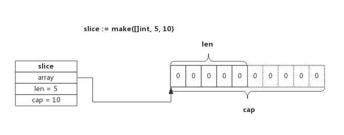
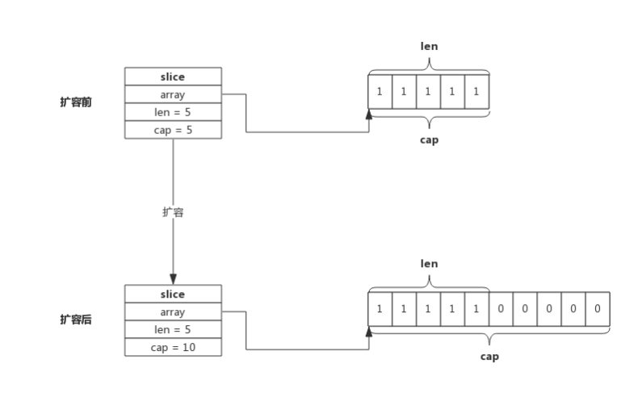

# Slice 切片

slice又称动态数组，依托数组实现，可以方便的进行扩容、传递等，实际使用中比数组更灵活

通过以下示例来了解slice切片的原理：
```gotemplate
var array [10]int
var slice = array[5:6]

fmt.Println("lenth of slice: ", len(slice))     //输出：1
fmt.Println("capacity of slice: ", cap(slice))  //输出：5
fmt.Println(&slice[0] == &array[5])             //输出：true
```
**解释：**
slice跟据数组array创建，与数组共享存储空间，slice起始位置是array[5]，长度为1，容量为5，slice[0]和array[5]地址相同

-----------------------

```gotemplate
func AddElement(slice []int, e int) []int {
    return append(slice, e)
}

func main() {
    var slice []int
    slice = append(slice, 1, 2, 3)

    newSlice := AddElement(slice, 4)
    fmt.Println(&slice[0] == &newSlice[0]) //输出：false
}
```
**解释：**
append函数执行时会判断切片容量是否能够存放新增元素，如果不能，则会重新申请存储空间，新存储空间将是原来的2倍或1.25倍（取决于扩展原空间大小），本例中实际执行了两次append操作，第一次空间增长到4，所以第二次append不会再扩容，所以新旧两个切片将共用一块存储空间。程序会输出"true"。


所以需要提前申请好足够的内存空间来支持后续新增元素的插入：
```gotemplate
slice := make([]int, 4)
slice = append(slice, 1, 2, 3)

newSlice := AddElement(slice, 4)
fmt.Println(&slice[0] == &newSlice[0]) //输出：true
```

## Slice实现原理

源码包中src/runtime/slice.go:slice定义了Slice的数据结构：
``` 
type slice struct {
    array unsafe.Pointer  //array指针指向底层数组
    len   int             //len表示切片长度
    cap   int             //cap表示底层数组容量
}
```

### 使用make创建Slice

使用make来创建Slice时，可以同时指定长度和容量，创建时底层会分配一个数组，数组的长度即容量。

例如，语句`slice := make([]int, 5, 10)`所创建的Slice，结构如下图所示：


该Slice长度为5，即可以使用下标slice[0] ~ slice[4]来操作里面的元素，capacity为10，表示后续向slice添加新的元素时可以不必重新分配内存，直接使用预留内存即可。

### 使用数组创建Slice

使用数组来创建Slice时，Slice将与原数组共用一部分内存。

例如，语句slice := array[5:7]所创建的Slice，结构如下图所示：

切片从数组array[5]开始，到数组array[7]结束（不含array[7]），即切片长度为2，数组后面的内容都作为切片的预留内存，即capacity为5。

数组和切片操作可能作用于同一块内存，这也是使用过程中需要注意的地方。

### Slice 扩容

使用append向Slice追加元素时，如果Slice空间不足，将会触发Slice扩容，扩容实际上重新一配一块更大的内存，将原Slice数据拷贝进新Slice，然后返回新Slice，扩容后再将数据追加进去。

例如，当向一个capacity为5，且length也为5的Slice再次追加1个元素时，就会发生扩容，如下图所示：

扩容操作只关心容量，会把原Slice数据拷贝到新Slice，追加数据由append在扩容结束后完成。上图可见，扩容后新的Slice长度仍然是5，但容量由5提升到了10，原Slice的数据也都拷贝到了新Slice指向的数组中。

扩容容量的选择遵循以下规则：
- 如果原Slice容量小于1024，则新Slice容量将扩大为原来的2倍；
- 如果原Slice容量大于等于1024，则新Slice容量将扩大为原来的1.25倍；


使用append()向Slice添加一个元素的实现步骤如下：
1. 假如Slice容量够用，则将新元素追加进去，Slice.len++，返回原Slice
2. 原Slice容量不够，则将Slice先扩容，扩容后得到新Slice
3. 将新元素追加进新Slice，Slice.len++，返回新的Slice。

### Slice Copy

使用copy()内置函数拷贝两个切片时，会将源切片的数据逐个拷贝到目的切片指向的数组中，拷贝数量取两个切片长度的最小值。

例如长度为10的切片拷贝到长度为5的切片时，将会拷贝5个元素。

也就是说，copy过程中不会发生扩容。

### 特殊切片

跟据数组或切片生成新的切片一般使用slice := array[start:end]方式，这种新生成的切片并没有指定切片的容量，实际上新切片的容量是从start开始直至array的结束。

比如下面两个切片，长度和容量都是一致的，使用共同的内存地址：
```gotemplate
sliceA := make([]int, 5, 10)
sliceB := sliceA[0:5]
```

根据数组或切片生成切片还有另一种写法，即切片同时也指定容量，即slice[start:end:cap], 其中cap即为新切片的容量，当然容量不能超过原切片实际值，如下所示：
```gotemplate
sliceA := make([]int, 5, 10)  //length = 5; capacity = 10
sliceB := sliceA[0:5]         //length = 5; capacity = 10
sliceC := sliceA[0:5:5]       //length = 5; capacity = 5
```